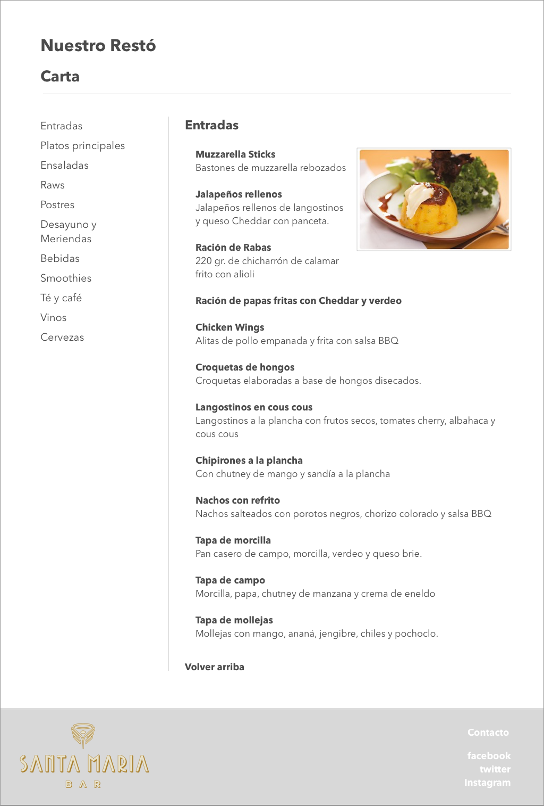
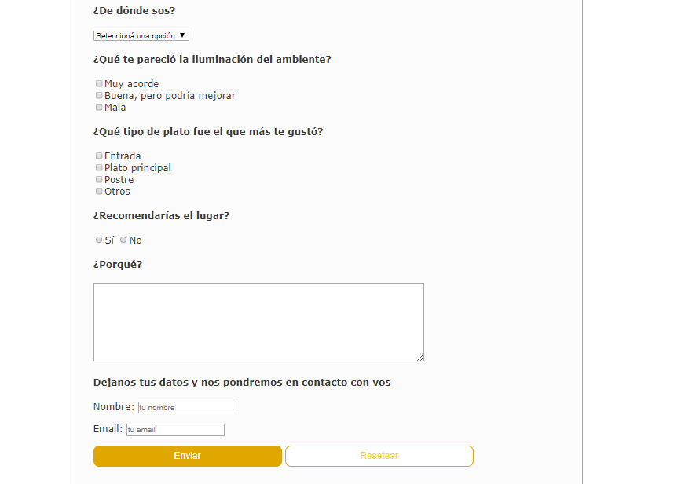

# Ejercitacion Presencial 1

## Ejercicios realizado con Digital House por Santiago Cortez

Esta ejercitacion consta en la recreacion de various mockups, teniendo que realizar:

* Maquetacion HTML
* Estilo CSS
* Emplear Box Model
* Proximamente Bootstrap

### Mockups

Boceto principal

Formulario

